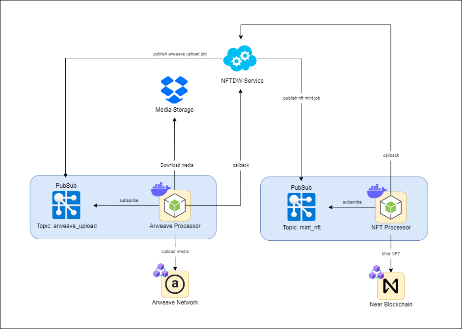

# Near NFT Processor

Near NFT Minter using Arweave and Near Protocol

## Architecture

## Jobs

- [Arweave Processor](./jobs/arweave_processor/README.md) - Service responsible for uploading media to the permaweb. Check [arweave processor local demo](./docs/assets/arweave_processor/DEMO.md) for instructions on how to simulate the service on local machine.
- [Near Processor](./jobs/near_processor/README.md) - Service responsible for minting the nfts and sending them to their respective owners.

## Contracts
- [NFT Contract](./contracts/nft/README.md)