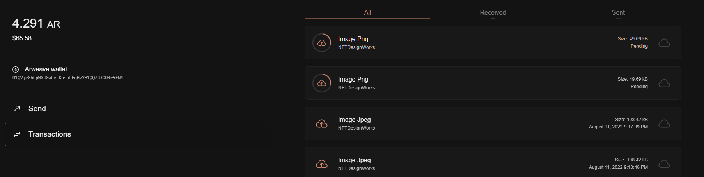

# Arweave Processor Local Demo

## Requirements
- [docker/docker-compose](https://docs.docker.com/get-docker/)

## Setting the Environment

create a .env file on jobs/arweave_processor directory

refer to [Environment Configuration](../../../jobs//arweave_processor/README.md#environment-configuration) for available keys, a .env.example file is also included in the directory for reference

## Build the Image
```bash
docker-compose build arweave_processor
```

## Install Dependencies
```bash
docker-compose run --rm arweave_processor install
```

## Run the Container

Once dependencies has been installed and .env file has been configured, processor service can be started easily using docker-compose.

```bash
# run the arweave processor
docker-compose up arweave_processor
```

Once the service is up and running, you can now interact with the queue using the [utility scripts](#utility-scripts) below

## Utility Scripts

Utility scripts are included in the repository.

```bash

# dispatch a test message on the configured storage queue
docker-compose run --rm arweave_processor dispatch:storage-queue

# peek first 32 messages from the storage queue
docker-compose run --rm arweave_processor peek:storage-queue

# clear storage queue
docker-compose run --rm arweave_processor clear:storage-queue
```

You can also import your wallet on [arweave.app](https://arweave.app) to see the created transactions
