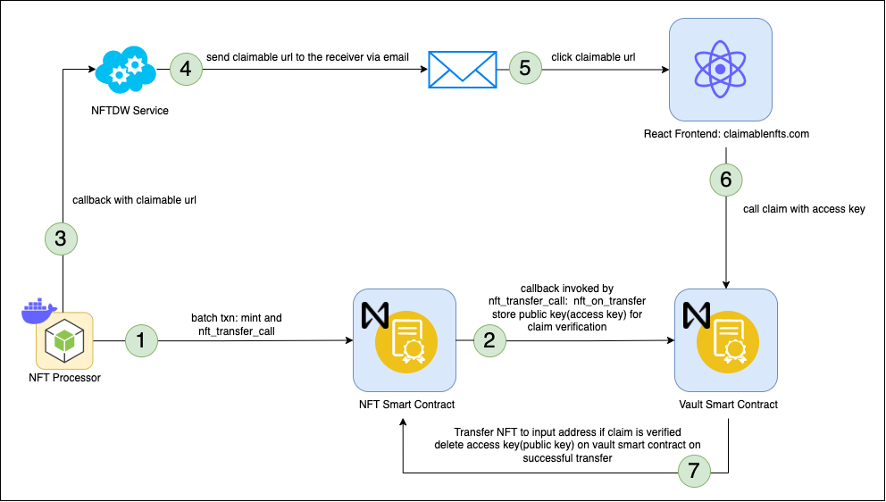
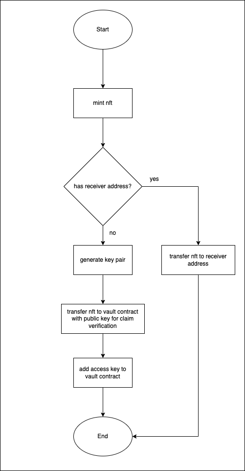
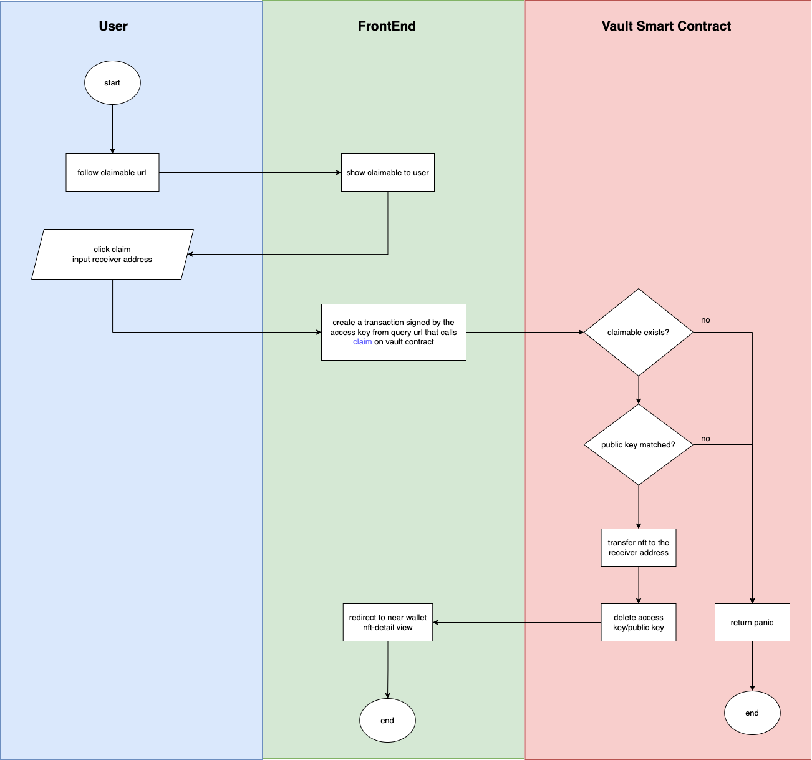

# Claimable NFT

## About

This document describes essential details regarding claiming of nfts that are locked on the vault contract.
    
Smart contract code can be found [here](../../../contracts/)

## Architecture

### NFT Processor
- a daemon service that mints nfts, and locks them on vault account if receiver is not present
- nft processor source code can be found [here](../../../jobs/near_processor/)

### NFT Smart Contract
- near nft standard smart contract [https://nomicon.io/Standards/Tokens/NonFungibleToken/](https://nomicon.io/Standards/Tokens/NonFungibleToken/)
- `nft_transfer_call` method calls `nft_on_transfer` on the receiver_id's account. [ref](https://nomicon.io/Standards/Tokens/NonFungibleToken/Core#nft-interface)
- nft smart contract source code can be found [here](../../../contracts/nft/)

### Vault Smart Contract
- near vault smart contract
- NFT receiver interface is implemented. [ref](https://nomicon.io/Standards/Tokens/NonFungibleToken/Core#receiver-interface)
- Receives nft together with a public key from the `nft_transfer_call` callback, stores the nft and the public key on the account state and adds the public key to the account's function call access keys, which allows anyone holding the private key of the corresponding public key to call the `claim` method in behalf of the vault account.
- The nft can be claimed from the vault, if the private key used to sign the transaction that calls the `claim` method, is matched with public key that is stored by the account from the `nft_on_tansfer` callback
- Upon successful claim, the nft and public key is deleted on the account's storage, also deletes the public key on the account's access keys
- vault contract source code can be found [here](../../../contracts/vault/)
- [sample claim txn](https://explorer.testnet.near.org/transactions/FneFtjU2zufjctZCnVnWznoUWiEaeYchcSkGJb2wxHS1)
    - this transaction is triggered by the claimer using an access key from the react frontend
    - notice that the transaction appears that it is signed by the vault contract, it is signed from the frontend using the associated public key that is added to the account's function call access keys, with this approach the vault contract will shoulder the gas fees for the user
    - the public key is also deleted from the account's function call access keys, which makes it a one time use key

## Security
- vault contract only accepts nfts from allowed accounts
    - to allow nfts to be locked on vaults [`allow_nft`](../../../contracts/vault/src/lib.rs) can be called on the vault contract
    - to view allowed nfts, call [`get_allowed_nfts`](../../../contracts/vault/src/lib.rs)
    - to delete an nft from the allowed list, call [`remove_allowed_nft`](../../../contracts/vault/src/lib.rs)
- claimable url contains a token query parameter, the token query parameter is a base64url string data that contains the private key that can be used to claim the nft
    - claimable url should be sent to the user securely, anyone that has access to the claimable url can claim the nft
- the private key from the claimable url token query parameter is added to the vault account's `claim` function call access keys, which allows the transactions fees to be charged on the vault account
- the `claim` method is marked as an internal method, which only allows it to be invoked by access keys added on the vault account's access keys
- `claim` function call checks if the claimable exists and if the private key used to sign the function call matches the public key stored on the storage
- upon successful claim, the access key is deleted on the account, making it a one time use access key

## Flow Chart
### NFT Locking Flow Chart

### NFT Claiming Flow Chart
