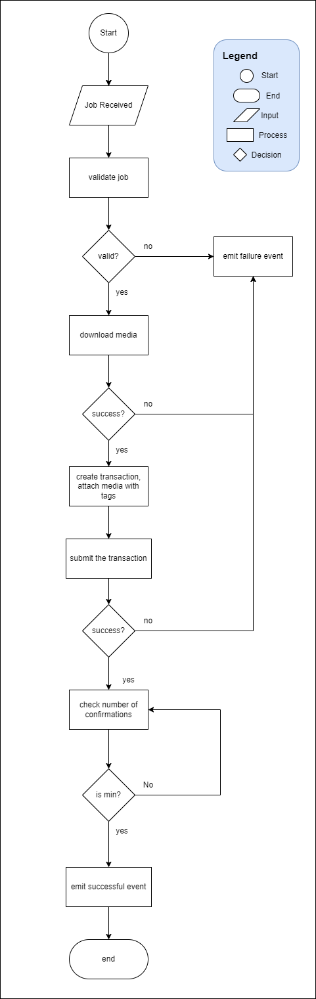

# Arweave Processor

Service responsible for uploading media to the permaweb.

## Environment Configuration
| Key | Description |
| :-- | :---------- |
| `QUEUE_URL` | url of the queue to listen for messages |
| `WALLET_JSON` | wallet to use, jwk in json string |
| `MIN_CONFIRMATIONS` | default number of confirmations before considering the arweave transaction to be successful |
| `DEFAULT_CALLBACK_URL` | default callback url that will receive the emitted events |

## Job Spec

The service will listen for messages on a pubsub queue, the message should be a valid json data that conforms with the format below.

Example Message from Queue
```json
{
    "JobId": "ff975cbd-32f4-4f09-9b9a-01964dd6eb90",
    "MediaURL":
    "https://nftdesignworks.blob.core.windows.net/mintedimages/429538da-ecfa-454f-9fe
d-b13b8b1de043.png",
    "Metadata": {
        "AthleteId": "128073",
        "FirstName": "Artūrs",
        "LastName": "Liepa",
        "Country": "LAT",
        ... REDACTED
    },
    "MinConfirmations": 15,
    "CallbackURL": "https://nftdw.com/arweave/callback"
}
```

| Field | Type | Description |
| :---- | :--- | :---------- |
| `JobId` | `string` | **Required**.  A unique string generated by the publisher of the message |
| `MediaURL` | `string` | **Required**. Url of the media to be uploaded to the permaweb |
| `Metadata` | `object` | **Optional**. nft metadata, should be deserialiazable into a json string |
| `MinConfirmations` | `number` | **Optional**. the number of confirmations from the network to consider the transaction as successful, defaults to **15** |
| `CallbackURL` | `string` | **Optional**. endpoint that will receive the events emitted by the processor, defaults to a given configuration |

## Events

the processor will emit events and send it to the configured `DEFAULT_CALLBACK_URL` if `CallbackURL` is not specified on jobs. 

### Started Event
Emmited to notify the callback url that the processor has received the job and is currently processing it.
```json
{
    "JobId": "ff975cbd-32f4-4f09-9b9a-01964dd6eb90",
    "Event": "started",
    "Time": 1659965535,
    "Message": "Job Started"
}
```
### Failure Event
Emmited to notify the callback url that an error has occured.
```json
{
    "JobId": "ff975cbd-32f4-4f09-9b9a-01964dd6eb90",
    "Event": "failure",
    "Time": 1659965535,
    "Message": "Example Error Message"
}

```
### Success Event
Emmited to notify the callback url that the job has successfully finished.
```json
{
    "JobId": "ff975cbd-32f4-4f09-9b9a-01964dd6eb90",
    "Event": "success",
    "Time": 1659965535,
    "Message": "Media has been successfully uploaded to the permaweb",
    "Details": {
        "TransactionID": "<ARWEAVE_TX_ID>",
        "Confirmations": 15
    }
}
```
## Process Flow


